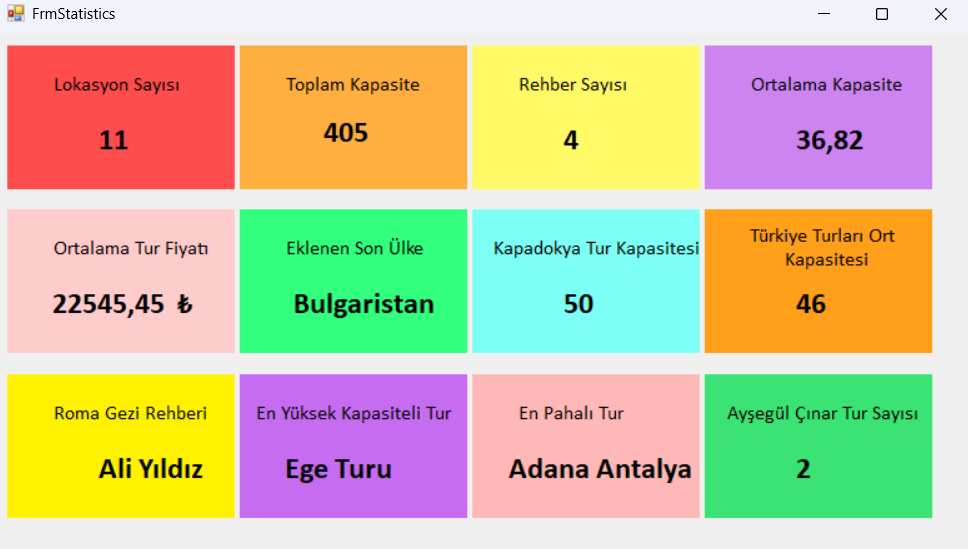

# C# Entity Framework Travel Management System

## Proje Hakkında

Bu proje, C# Windows Forms ve Entity Framework kullanılarak geliştirilmiş bir seyahat yönetim sistemidir. Tur lokasyonları, rehberler ve müşteriler üzerinde CRUD (Create, Read, Update, Delete) işlemleri gerçekleştirmeye olanak tanır.

## Teknolojiler

- **Framework:** .NET Framework 4.7.2
- **ORM:** Entity Framework 6.2.0
- **Veritabanı:** SQL Server Express
- **UI:** Windows Forms

## Veritabanı Yapısı

Proje 4 ana tablo içermektedir:

- **TblGuide:** Tur rehberleri (Ad, Soyad)
- **TblLocation:** Tur lokasyonları (Şehir, Ülke, Kapasite, Fiyat, Gün/Gece, Rehber)
- **TblCustomer:** Müşteriler (Ad, Soyad, Bakiye)
- **Admin:** Yönetici bilgileri (Kullanıcı adı, Şifre)

## Özellikler

### 1. Rehber Yönetimi (Form1)

- Rehber listeleme
- Yeni rehber ekleme
- Rehber silme
- Rehber güncelleme
- ID'ye göre rehber arama

### 2. Lokasyon Yönetimi (FrmLocation)

- Lokasyon listeleme
- Yeni lokasyon ekleme (şehir, ülke, kapasite, fiyat, süre)
- Lokasyon silme
- Lokasyon güncelleme
- Rehber atama (ComboBox ile)

### 3. İstatistikler (FrmStatistics)

Dashboard görünümünde 12 farklı istatistik:

- Toplam lokasyon sayısı
- Toplam kapasite
- Toplam rehber sayısı
- Ortalama kapasite
- Ortalama tur fiyatı
- Eklenen son ülke
- Kapadokya tur kapasitesi
- Türkiye turları ortalama kapasitesi
- Roma gezisi rehberi
- En yüksek kapasiteli tur
- En pahalı tur
- Ayşegül Çınar'ın tur sayısı

## Ekran Görüntüsü

